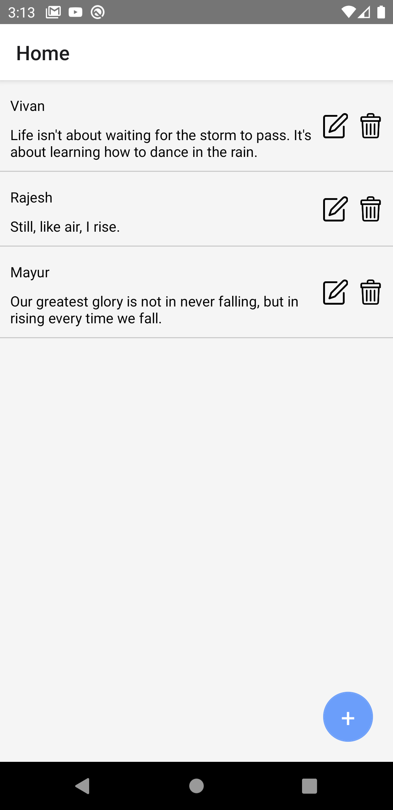
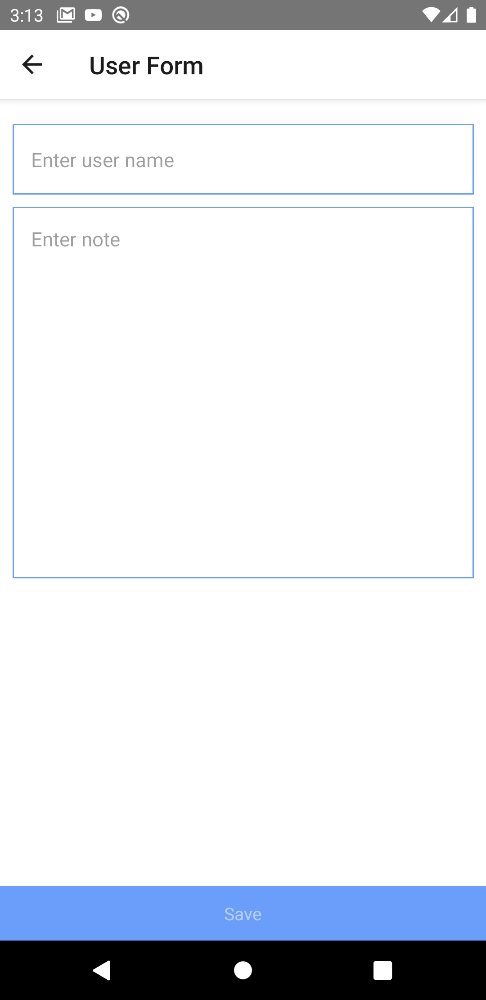
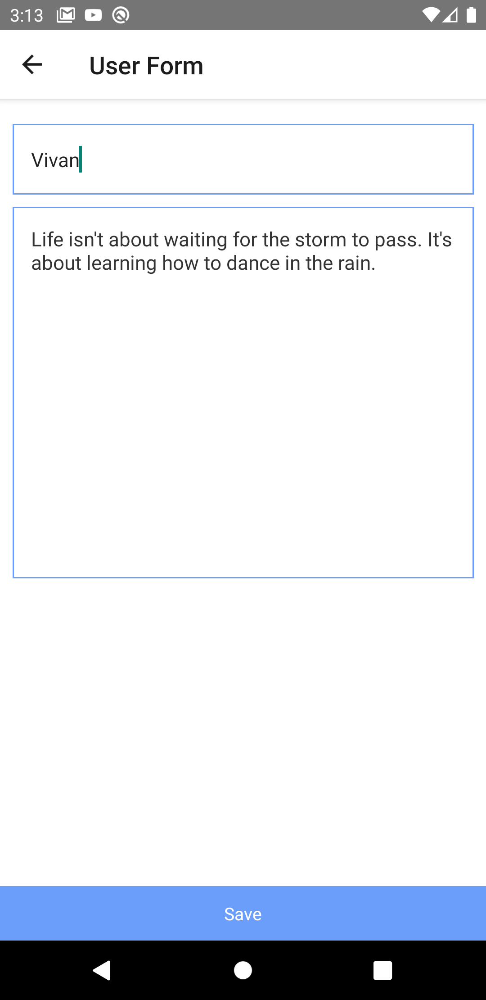

# user-crud-redux
 

 How to implement CRUD operations with using redux
 

 In this tutorial, we'll make a simple CRUD app that can add, update, or delete user using redux.
  

 

    
                                         
     

                                                                                                
Running the project

 
Assuming you have all the requirements installed, you can setup and run the project by running:

* yarn install to install the dependencies
* run the following steps for your platform

Android

 * only the first time you run the project
 * yarn start to start the metro bundler, in a dedicated terminal
 * yarn android to run the Android application (remember to start a simulator or connect an Android phone)
 
IOS

cd ios
pod install to install pod dependencies
cd .. to come back to the root folder
yarn start to start the metro bundler, in a dedicated terminal
yarn ios to run the iOS application (remember to start a simulator or connect an iPhone phone)
